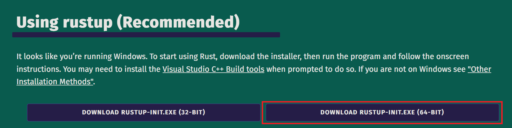
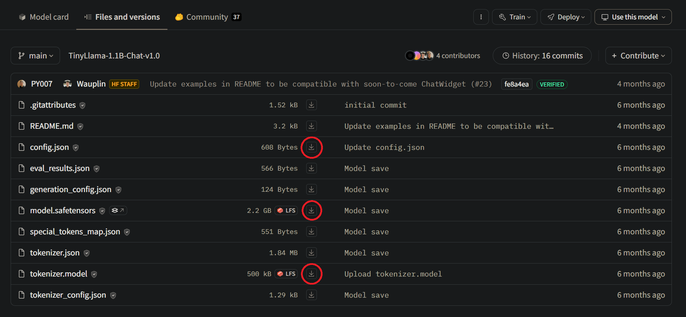
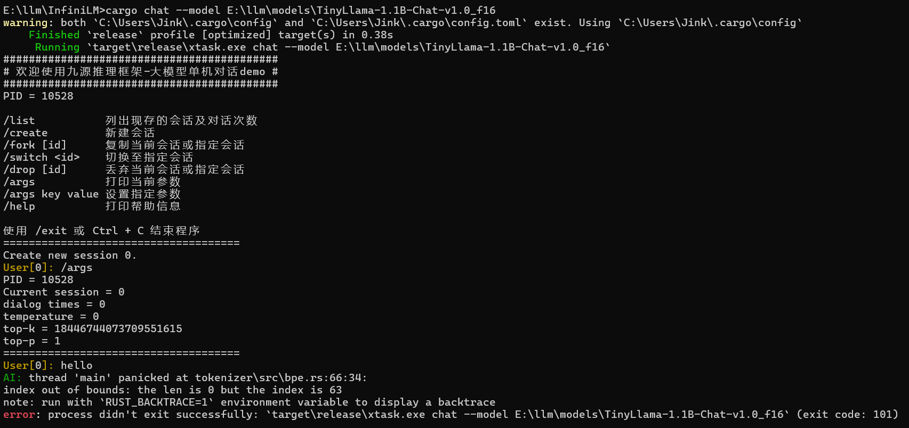
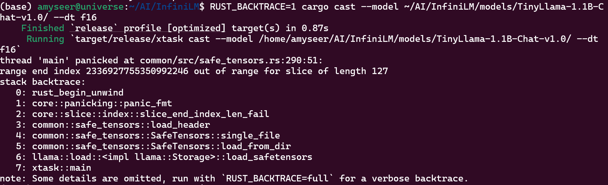
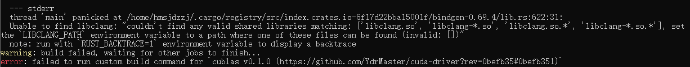
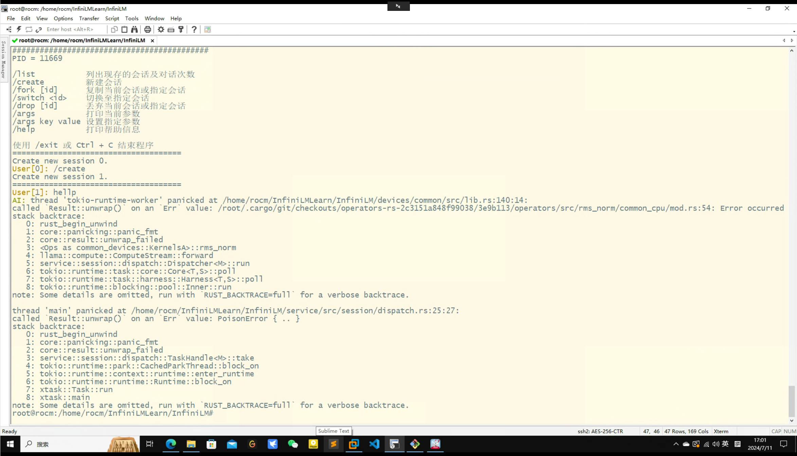
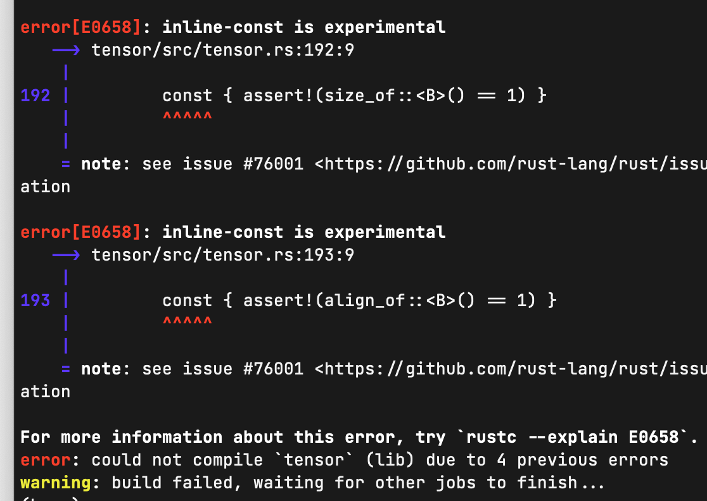

# 使用指南

依此指南操作，可在本地计算机运行大模型推理，实现对话和文本生成任务。下列步骤完成了 4 项工作：

1. 准备 Rust 环境；
2. 获取 InfiniLM 推理引擎源码；
3. 下载模型文件；
4. 执行推理；

## 步骤

### 1. 准备 Rust 环境

> **NOTICE** 下列操作来自[Rust 主页](https://www.rust-lang.org/zh-CN/tools/install)。

根据操作系统环境选择下列步骤之一：

#### 1.1 Windows Native

> **NOTICE** Windows 用户推荐采用原生 Windows 环境开发 Rust 项目。

> **NOTICE** Rust 工具链依赖 Visual Studio 作为基础，参考[微软官方文档](https://learn.microsoft.com/zh-cn/windows/dev-environment/rust/setup#install-visual-studio-recommended-or-the-microsoft-c-build-tools)安装。下述简单步骤假设用户已经准备好 Visual Studio 或 Microsoft C++ 生成工具。

如图所示，下载并运行安装程序。



**Just press enter!**

```plaintext
The Cargo home directory is located at:

  C:\Users\$USER\.cargo

This can be modified with the CARGO_HOME environment variable.

The cargo, rustc, rustup and other commands will be added to
Cargo's bin directory, located at:

  C:\Users\$USER\.cargo\bin

This path will then be added to your PATH environment variable by
modifying the HKEY_CURRENT_USER/Environment/PATH registry key.

You can uninstall at any time with rustup self uninstall and
these changes will be reverted.

Current installation options:


   default host triple: x86_64-pc-windows-msvc
     default toolchain: stable (default)
               profile: default
  modify PATH variable: yes

1) Proceed with standard installation (default - just press enter)
2) Customize installation
3) Cancel installation
>
```

#### 1.2 WSL

> **NOTICE** 仅针对已有配置好的 WSL2 且不方便在原生 Windows 环境开发的情况，因此配置 WSL2 的步骤不再介绍。

> **NOTICE** Windows 用户首选原生 Windows 环境，其次 WSL2，**不推荐**使用 MinGW/Cygwin 或其他第三方虚拟机软件。

在 WSL2 Bash 中使用此命令安装 Rust（Just press enter!）：

```shell
curl --proto '=https' --tlsv1.2 -sSf https://sh.rustup.rs | sh
```

#### 1.3 Linux

原生 Linux 环境安装方式同 WSL。

#### 1.4 更新 Rust

本项目依赖 Rust 1.79（Latest Stable at 2024/07），已安装 Rust 工具链的用户使用此命令升级：

```shell
rustup update
```

#### 1.5 Nvidia 支持

本项目基于 bindgen 绑定 Nvidia 驱动，同时依赖 xmake 完成部分 CUDA 代码编译，环境中需要安装 Clang 和 xmake。

希望使用 Nvidia 加速的用户，请参考 [bindgen 官方手册](https://rust-lang.github.io/rust-bindgen/requirements.html)安装 Clang，参考 [xmake 官方手册](https://xmake.io/#/zh-cn/getting_started?id=%e5%ae%89%e8%a3%85)安装 xmake。

安装了 CUDA 工具链但不希望使用的用户（可能由于版本冲突、权限不足或其他问题），须自行关闭 nvidia feature。修改 [xtask crate 的 Cargo.toml](/xtask/Cargo.toml#L39):

```toml
# default = ["nvidia", "cambricon"]
```

### 2. 获取 InfiniLM 推理引擎源码

使用

```shell
git clone https://github.com/InfiniTensor/InfiniLM
```

或配置 ssh 并使用：

```shell
git clone git@github.com:InfiniTensor/InfiniLM.git
```

获取推理引擎。

### 3. 下载模型

推荐使用 TinyLlama-1.1B-Chat-v1.0 模型，因为这个模型在规模、性能和使用便捷性方面较为平衡。

从[官方网站](https://huggingface.co/TinyLlama/TinyLlama-1.1B-Chat-v1.0/tree/main) 或[镜像站](https://hf-mirror.com/TinyLlama/TinyLlama-1.1B-Chat-v1.0/tree/main) 下载模型文件。点击网页下载下列 3 个文件即可：

> **NOTICE** 不推荐使用 git 拉取，因为 git LFS 配置复杂效果也不好。



### 4. 执行推理

#### 4.1 准备模型文件

将上一步骤下载的 3 个文件移动到同一个目录，假设为 `tinyllama_origin`。然后进入 InfiniLM 项目根目录并执行此命令，以转换模型格式：

```shell
cargo cast --model tinyllama_origin --dt f16
```

> **NOTICE** 上述 `tinyllama_origin` 目录为示例占位路径，请用户自行替换成实际路径。

> **NOTICE** 上述形式不意味着需要将模型文件放到 InfiniLM 项目根目录。且**不推荐**用户将模型文件放入项目目录，以免干扰 git 追踪。

> **NOTICE** `--model` 参数允许传入相对路径或绝对路径。例如，在 `InfiniLM` 目录同级创建 `tinyllama_origin` 目录时，参数为 `--model ../tinyllama_origin`。

> **NOTICE** Windows 上安装了 Nvidia 加速环境的用户此命令将额外产生多个形式如下的警告：
>
> ```plaintext
> warning: common-nv@0.0.0: Compiler family detection failed due to error: ToolExecError: Command "nvcc" "-E" "...\\target\\release\\build\\common-nv-f91598a6e4b91d5b\\out\\7081333750370202046detect_compiler_family.c" with args nvcc did not execute successfully (status code exit code: 1).
> ```
>
> 这些警告可以忽略，不影响命令执行。

此命令执行成功后将在 `tinyllama_origin` 目录同级生成 `tinyllama_origin_f16` 文件夹，其中包含转换后的模型文件。

#### 4.2 文本生成及采样参数

执行：

```shell
cargo generate --model tinyllama_origin_f16 --prompt "Once upon a time,"
```

输出：

```plaintext
Finished `release` profile [optimized] target(s) in 0.22s
   Running `target\release\xtask.exe generate --model tinyllama_origin_f16 --prompt "Once upon a time,"`

Once upon a time, there was a young girl named Lily. Lily was a kind and gentle soul, always looking for ways to help others. She loved to read, and her favorite book was about a brave knight who saved a princess from a dragon.

...
```

> **NOTICE** 此命令的 `--model` 参数相关要求与前述 cast 命令相同。

用户可能发现，对于相同的模型和提示词，每次生成的结果完全相同。这是因为模型默认采用“最优”的采样策略。这种采样方式也可能产生极长或重复的结果。通过设置随机采样参数，可以得到多样性的结果，且可能更符合人类阅读习惯：

```shell
cargo generate --model tinyllama_origin_f16 --prompt "Once upon a time," --temperature 0.9 --top-p 0.9 --top-k 100
```

额外的 3 个参数，`temperature` 影响模型的随机性，推荐取值范围 [0.5, 2.0]；`top-p` 和 `top-k` 影响采样的范围，`top-p` 推荐取值范围 [0.5, 1.0]，`top-k` 推荐取值范围 [20, 200]。

#### 4.3 对话

执行此命令：

```shell
cargo chat --model tinyllama_origin_f16
```

启动对话：

```plaintext
    Finished `release` profile [optimized] target(s) in 0.22s
     Running `target\release\xtask.exe chat --model ..\tinyllama_origin_f16\`

######################################
# 欢迎使用九源推理框架-大模型单机对话demo #
######################################
PID = 3596

/list           列出现存的会话及对话次数
/create         新建会话
/fork [id]      复制当前会话或指定会话
/switch <id>    切换至指定会话
/drop [id]      丢弃当前会话或指定会话
/args           打印当前参数
/args key value 设置指定参数
/help           打印帮助信息

使用 /exit 或 Ctrl + C 结束程序
=====================================

Create new session 0.
User[0]:
```

用户可交互输入开始对话。

> **NOTICE** 此命令的 `--model` 参数相关要求与前述 cast 命令相同。

> **NOTICE** 此命令默认同样采用“最优”的采样策略，设置随机采样参数的方式与前述 generate 命令相同。

#### 4.4 硬件加速

如果用户希望启用加速硬件提升推理速度，可使用：

```shell
cargo list-turbo
```

命令检测系统中的加速硬件，可能的输出如下：

```plaintext
NVidia CUDA environment detected, use `--turbo nv:` to select.
GPU0: NVIDIA GeForce RTX 3060 Ti | cc=8.6 | memory=8388096KiB
```

如果检测到加速硬件，在推理时添加对应的选项可启用加速：

- 使用 0 号 Nvidia 显卡加速

  ```shell
  cargo chat --model tinyllama_origin_f16 --turbo nv
  ```

- 使用 1 号 Nvidia 显卡加速

  ```shell
  cargo chat --model tinyllama_origin_f16 --turbo nv:1
  ```

- 使用 2,3 号 Nvidia 显卡分布式加速

  ```shell
  cargo chat --model tinyllama_origin_f16 --turbo nv:2,3
  ```

- 使用 0~7 号 Nvidia 显卡分布式加速

  ```shell
  cargo chat --model tinyllama_origin_f16 --turbo nv:0..8
  ```

## 运行中的常见问题

### `index out of bounds:`



以上输出的原因是使用 git clone 模型仓库，但未安装或初始化 git lfs，导致模型文件（model.safetensors）仍是大文件占位符。

不推荐使用 git 克隆模型仓库，推荐直接下载需要的文件。返回[步骤 3](#3-下载模型) 操作。

### `range end index 2336927755350992246 out of range for slice of length 127`



在执行 `cast` 模型操作时出现以上输出一般是因为模型文件不完整导致，同 [`out of bounds:`问题](#index-out-of-bounds) 参考 [步骤 3](#3-下载模型) 解决。

### `Unable to find libclang:`



以上输出的原因是安装了 Nvidia 工具链，但没有安装 `clang`。安装方法和用途可[本文 1.5 节](#1-准备-rust-环境)，或关闭 nvidia features，见 [步骤 1.5](#15-nvidia-支持)。

### `thread 'main' panicked at xtask\src\cast.rs:29:66: ... Io(Os { code: 2, kind: NotFound, message: "No such file or directory" }) ...`

```plaintext
    Finished `release` profile [optimized] target(s) in 0.26s
     Running `target\release\xtask.exe cast --model tinyllama_origin_f16 --dt f16`
thread 'main' panicked at xtask\src\cast.rs:29:66:
called `Result::unwrap()` on an `Err` value: Io(Os { code: 2, kind: NotFound, message: "系统找不到指定的文件。" })
note: run with `RUST_BACKTRACE=1` environment variable to display a backtrace
error: process didn't exit successfully: `target\release\xtask.exe cast -m . --dt f16` (exit code: 101)
```

遇到以上输出原因一般是 `--model` 指定的模型路径问题，请检查指定的模型路径是否正确。查看源代码 `./xtask/src/cast.rs:29:66` 可知：

```rust
...
let model = llama::Storage::load_safetensors(&model_dir).unwrap();
...
```

这行代码将 `--model` 指定的模型路径通过 `load_safetensors` 方法加载到内存，最后 `unwrap()` 报错。更深入定位通过查看 `load_safetensors` 方法实现结合报错信息可定位报错原因：

```rust
pub fn load_safetensors(model_dir: impl AsRef<Path>) -> Result<Self, FileLoadError> {
    let config = File::open(model_dir.as_ref().join("config.json")).map_err(Io)?;
    let config: ConfigJson = serde_json::from_reader(&config).map_err(Json)?;
    let model = SafeTensors::load_from_dir(model_dir)?.share();
    ...
}
```

这里应该是在 `let config = File::open(model_dir.as_ref().join("config.json")).map_err(Io)?;` 报错返回了一个 `Io` 错误；`from_reader` 返回错误类型为 `Json`，并不符合报错信息；`load_from_dir` 返回错误的 `message` 为 `"No valid safetensors file found"`，故也不符合。

> **NOTICE** 注意某些杀毒软件可能将编译出的 xtask 可执行文件识别为风险应用程序

### `thread 'tokio-runtime-worker' paniced at ...` 和 `thred 'main' paniced at ...`



以上输出原因为运行 `cargo chat --model` 指定的模型路径不正确导致，请检查提供的模型路径。

### `error[E0658]: inline-const is experimental`



以上输出因为 Rust 版本过低不支持特性导致，请检查自己的 `rustc` 版本并升级到 `stable` 的 1.79.0 或更高的 `nightly` 版本。

### 模型胡言乱语，生成质量差，循环输出相同或相似内容

见 [步骤 4.2](#42-文本生成及采样参数)，修改采样参数。注意使用 `-h/--help` 回忆配置方式：

```plaintext
Options:
  -m, --model <MODEL>              Model directory
      --model-type <MODEL_TYPE>    Model type, maybe "llama", "mixtral", "llama" by default
      --log <LOG>                  Log level, may be "off", "trace", "debug", "info" or "error"
      --temperature <TEMPERATURE>  Random sample temperature
      --top-k <TOP_K>              Random sample top-k
      --top-p <TOP_P>              Random sample top-p
      --turbo <TURBO>              Select turbo hardware, the format is "ty:detail"
  -p, --prompt <PROMPT>            Prompt
      --max-steps <MAX_STEPS>      Max number of steps to generate
  -h, --help                       Print help
```

如果生成质量差的问题无法缓解，可以尝试选择更大的模型。

### 推理时配置 `--turbo nv:...` 但 `Turbo environment not detected`

```plaintext
     Running `target\release\xtask.exe chat -m ..\tinyllama-origin_f16\ --turbo nv`
thread 'main' panicked at xtask\src/main.rs:222:22:
Turbo environment not detected
note: run with `RUST_BACKTRACE=1` environment variable to display a backtrace
```

以上输出建议编写一个 binary crate 用 [find_cuda_driver](https://crates.io/crates/find_cuda_helper) 搜索 CUDA 环境做进一步分析。
